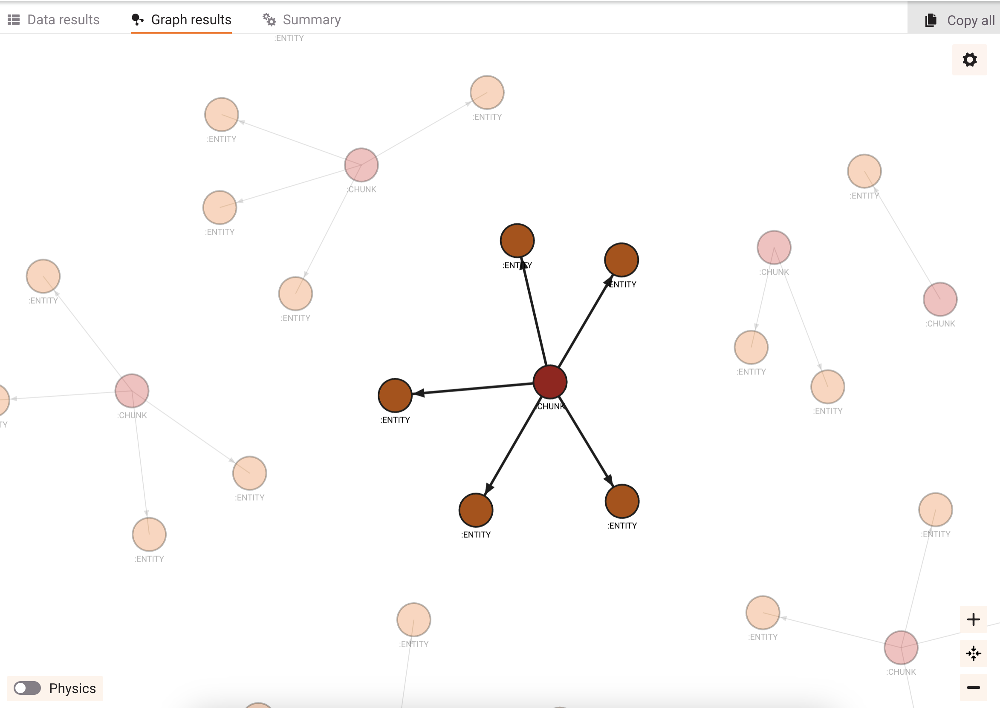

# True Knowledge Graph with Memgraph on Climate Change Litigation Database

[](https://meg-patakota.github.io)
[](https://meg-patakota.github.io)
[](https://github.com/yourusername/knowledge-graph-climate-litigation-cases)

> ⚠️ **Disclaimer:** This project is currently under active development. Features, code, and documentation are subject to change as it evolves.

## Table of Contents
- [Installation](#installation)
- [Graph Architecture](#graph-architecture)
    - [Graph setup](#graph-setup)
- [About the Data](#about-data)
    - [About the Graph](#about-the-graph)
- [Next Steps](#next-steps)
- [Contributing](#contributing)

## Installation

Clone the repository and install dependencies using **Poetry**:

```bash
git clone https://github.com/yourusername/knowledge-graph-climate-litigation-cases.git
cd knowledge-graph-climate-litigation-cases
poetry install
```

## Graph Architecture

### Graph setup
The current setup works by running docker for memgraph and running memgraph lab image.
More information on [memgraph site](https://memgraph.com/docs/getting-started/install-memgraph/docker#run-memgraph-lab-image)
```
docker run -d -p 3000:3000 -e QUICK_CONNECT_MG_HOST=host.docker.internal --name lab memgraph/lab
```
```
docker run -p 7687:7687 -p 7444:7444 memgraph/memgraph-mage
```
Start the [local host](http://localhost:3000/login)

#### Cypher query to run in memgraph to view nodes, entities and relationship
```
MATCH (c:CHUNK)-[r:HAS_ENTITY]->(e:ENTITY)
RETURN c, e, r;
```


## About the Data 
[Sabin Center for Climate Change Law](https://climatecasechart.com)

### About the Graph
- **Purpose of the Graph**: The graph visualizes relationships within a dataset of climate litigation cases, focusing on extracting and connecting key components, such as document chunks (CHUNK) and related entities (ENTITY), to explore the legal landscape of climate change litigation.

- **Node Representation**: 
  - **CHUNK Nodes**: Represent specific text chunks or sections from legal documents related to climate change litigation.
  - **ENTITY Nodes**: Represent named entities such as organizations, locations, people, and dates extracted from these chunks.

- **Relationship Creation**:
  - **HAS_ENTITY Relationship**: Connects CHUNK nodes to their corresponding ENTITY nodes, indicating where in the document specific entities are mentioned, which helps in analyzing the context of these mentions.

- **Graph Queries**: Users can run Cypher queries to view the connections between document chunks and entities, aiding in the discovery of how key entities (e.g., companies, governments, locations) are involved across multiple climate litigation cases.

- **Value Proposition**:
  - **Insight Discovery**: By structuring the litigation data as a graph, it enables complex queries and visual exploration, allowing legal researchers to quickly identify patterns, such as which entities are frequently mentioned across cases.
  - **Enhanced Understanding**: This graph approach provides a more interactive and insightful way to study climate litigation cases than traditional text-based analysis, as it highlights the relationships between different parts of the data.
  - **Scalable Analysis**: The architecture allows for easy scaling, meaning that additional litigation cases or entity types can be incorporated into the graph over time to expand its utility.


## Next Steps
- **Deduplication**: Implement a strategy to detect and merge duplicate nodes to avoid redundancy and improve graph accuracy.
- **Performance Optimization**: Explore batching or parallel processing for faster node and relationship creation, and optimize query performance with indexing.
- **Entity Expansion**: Enhance entity extraction by integrating advanced NLP techniques and external knowledge bases to enrich ENTITY nodes.
- **Schema Refinement**: Refine the graph schema with more detailed node categories and relationship types for deeper analysis.
- **Data Validation**: Implement automated checks for data consistency and accuracy before graph insertion.


## Contributing

Contributions to this project are welcome! If you're interested in contributing or using this project, please follow these steps:

1. Check out my [GitHub.io page](https://meg-patakota.github.io) for contact details and more information about my work.
2. Feel free to open an issue to discuss potential changes or improvements.
3. If you'd like to make direct changes, please submit a Pull Request.

I appreciate your interest in my project and look forward to potential collaborations!

## License

This is a personal project created and maintained by Meg Patakota. All rights reserved. This project is not licensed for use, modification, or distribution without explicit permission from the author.

