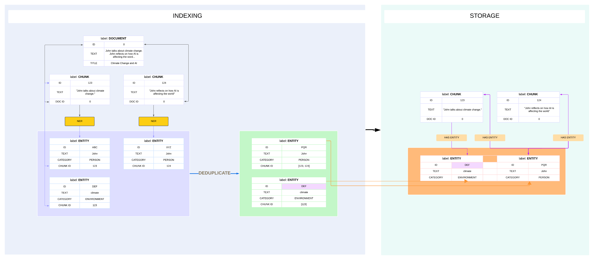

# True Knowledge Graph with Memgraph on Climate Change Litigation Database

[](https://meg-patakota.github.io)
[](https://meg-patakota.github.io)
[](https://github.com/yourusername/knowledge-graph-)

> ⚠️ **Disclaimer:** This project is currently under active development. Features, code, and documentation are subject to change as it evolves.

## Table of Contents
- [Installation](#installation)
    - [Graph setup](#graph-setup)
- [Graph Architecture](#graph-architecture)
- [Contributing](#contributing)

## Installation

Clone the repository and install dependencies using **Poetry**:

```bash
git clone https://github.com/yourusername/knowledge-graph-climate-litigation.git
cd knowledge-graph-climate-litigation
poetry install
```

### Graph setup
The current setup works by running docker for memgraph and running memgraph lab image.
More information on [memgraph site](https://memgraph.com/docs/getting-started/install-memgraph/docker#run-memgraph-lab-image)
```
docker run -d -p 3000:3000 -e QUICK_CONNECT_MG_HOST=host.docker.internal --name lab memgraph/lab
```
```
docker run -p 7687:7687 -p 7444:7444 memgraph/memgraph-mage
```
Start the [local host](http://localhost:3000/login)

#### Cypher query to run in memgraph to view nodes, entities and relationship
```
MATCH (c:CHUNK)-[r:HAS_ENTITY]->(e:ENTITY)
RETURN c, e, r;
```

## Graph Architecture


## Contributing

Contributions to this project are welcome! If you're interested in contributing or using this project, please follow these steps:

1. Check out my [GitHub.io page](https://meg-patakota.github.io) for contact details and more information about my work.
2. Feel free to open an issue to discuss potential changes or improvements.
3. If you'd like to make direct changes, please submit a Pull Request.

I appreciate your interest in my project and look forward to potential collaborations!

## License

This is a personal project created and maintained by Meg Patakota. All rights reserved. This project is not licensed for use, modification, or distribution without explicit permission from the author.

